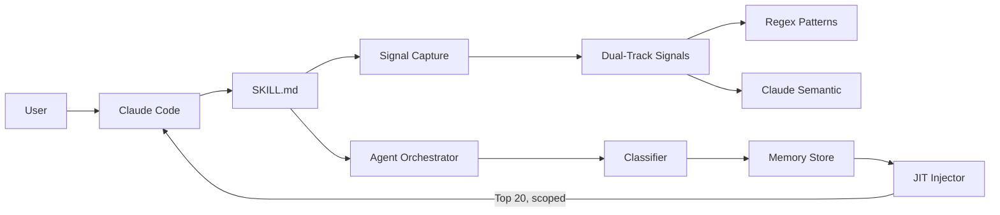
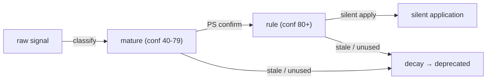

# Nest — 你的偏好，越用越合身

**WASC June Challenge: 自成長 · 越用越懂你**

A self-growing Claude Code Skill that learns your coding preferences from both dialog corrections and code-diff behavior, then silently applies them — reducing repetition with every session.

> The more you use it, the more it fits. The more it learns, the quieter it gets.

## Architecture

Python does the mechanical work (signal capture, storage, JIT injection). Claude Code does the intelligent work (semantic grouping, classification, confidence judgment).



## Memory Lifecycle



## Highlights

| Dimension | Implementation |
|---|---|
| **Signal Source** | Dual-track: dialog text + code-diff behavior |
| **Classification** | Claude Code native (zero external API) |
| **Memory Application** | JIT context injection — Top 20 most relevant, filtered by project/directory/scope |
| **Confidence Lifecycle** | raw (1-39) → mature (40-79, PS confirmation) → rule (80+, silent) → decay |
| **Scope Awareness** | global / project / directory — same project, different folders, different rules |
| **Validation** | 108 real Claude Code sessions, 100/100 WASC rubric score |

## v1 vs v2

| | v1 | v2 |
|---|---|---|
| Signal Source | Dialog text only | Dialog + Diff behavior |
| Classification | Python + DeepSeek API | Claude Code native |
| Application | Full injection | JIT context injection (Top 20) |
| User Interaction | 6 MCP tools | CLI scripts + lightweight PS confirmation |
| External Dependencies | anthropic SDK | **Zero** |
| Signal Capture | Regex only | **Dual-track**: Regex + Claude gap-filling |

## Repository Map

```
skill/                            — Host-agent skill entry (installed by Claude Code)
  SKILL.md                        — Skill instructions and trigger rules

src/                              — Core engine (zero pip dependencies)
  signal_capture.py               — Dual-track signal detection (regex + Claude)
  classifier.py                   — Memory classification and confidence assignment
  memory_store.py                 — Local JSON store with CRUD
  models.py                       — Memory and Signal data models
  agent.py                        — Orchestrator: JIT injection, pulse, summary

scripts/                          — CLI tools
  demo.py                         — 8-step WASC demo
  view_memory.py                  — List all memories
  edit_memory.py                  — Edit memory by ID
  delete_memory.py                — Delete memory by ID
  reset_memory.py                 — Clear all memories

tests/                            — Test suite
  test_harness.py                 — Rubric scoring (100/100)
  test_store.py / test_agent.py   — Unit tests
  test_signal_capture.py          — Signal detection tests
  test_classifier.py              — Classification tests
```

## Quick Start

```bash
pip install -e .
python3 scripts/demo.py           # 8-step WASC demo
python3 tests/test_harness.py     # Rubric scoring (100/100)
```

## CLI Commands

In Claude Code, invoke via `/memory`:

```bash
/memory view                      # List all active memories
/memory edit <id> '<json>'        # Edit a memory by ID
/memory delete <id>               # Delete a memory by ID
/memory reset                     # Clear all memories
```

## Requirements

- Python 3.12+
- Claude Code
- **Zero** pip dependencies
- **Zero** external API keys

[中文說明](README_CN.md)
