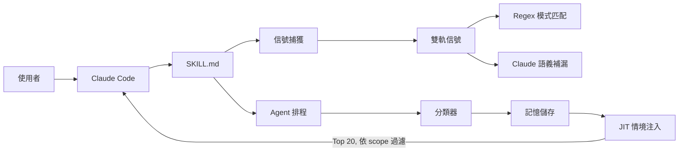
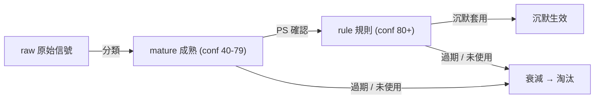

# Nest — 你的偏好，越用越合身

**WASC 六月挑戰：自成長 · 越用越懂你**

一個在背景默默觀察你的糾正和程式碼修改，學習偏好，然後沉默應用的 Claude Code Skill。

> 越用越安靜，越用越準。

## 架構

Python 做機械的事（信號捕獲、儲存、JIT 注入）。Claude Code 做智慧的事（語義分組、分類、信心判斷）。零外部 API。



## 記憶生命週期



## 核心特色

| 維度 | 實作 |
|---|---|
| **信號來源** | 雙軌：對話文字 + Diff 行為 |
| **分類方式** | Claude Code 原生（零外部 API） |
| **記憶應用** | JIT 情境注入 — Top 20，依 project/directory/scope 過濾 |
| **信心生命週期** | raw (1-39) → mature (40-79, PS 輕量確認) → rule (80+, 沉默) → decay |
| **情境感知** | global / project / directory — 同一專案，不同目錄，不同規則 |
| **驗證** | 108 個真實 Claude Code 對話交叉驗證，WASC 6 維度 100/100 |

## v1 vs v2

| | v1 | v2 |
|---|---|---|
| 信號來源 | 僅對話文字 | 對話 + Diff 行為 |
| 分類方式 | Python + DeepSeek API | Claude Code 原生 |
| 應用方式 | 全量注入 | JIT 情境注入 (Top 20) |
| 用戶互動 | 6 個 MCP 工具 | CLI 腳本 + PS 輕量確認 |
| 外部依賴 | anthropic SDK | **零** |
| 信號捕獲 | 只看 regex | **雙軌**：regex + Claude 補漏 |

## 專案結構

```
skill/                            — Host-agent skill 入口（Claude Code 安裝用）
  SKILL.md                        — Skill 指令與觸發規則

src/                              — 核心引擎（零 pip 依賴）
  signal_capture.py               — 雙軌信號偵測（regex + Claude）
  classifier.py                   — 記憶分類與信心評分
  memory_store.py                 — 本地 JSON 儲存（CRUD）
  models.py                       — Memory / Signal 資料模型
  agent.py                        — 排程器：JIT 注入、學習脈搏、摘要

scripts/                          — CLI 工具
  demo.py                         — 8 步 WASC demo
  view_memory.py                  — 列出全部記憶
  edit_memory.py                  — 按 ID 編輯記憶
  delete_memory.py                — 按 ID 刪除記憶
  reset_memory.py                 — 清除全部記憶

tests/                            — 測試
  test_harness.py                 — Rubric 評分 (100/100)
  test_store.py / test_agent.py   — 單元測試
  test_signal_capture.py          — 信號偵測測試
  test_classifier.py              — 分類測試
```

## 快速開始

```bash
pip install -e .
python3 scripts/demo.py           # 8 步 WASC demo
python3 tests/test_harness.py     # Rubric 評分 (100/100)
```

## CLI 指令

在 Claude Code 中透過 `/memory` 呼叫：

```bash
/memory view                      # 列出所有活躍記憶
/memory edit <id> '<json>'        # 按 ID 編輯記憶
/memory delete <id>               # 按 ID 刪除記憶
/memory reset                     # 清除全部記憶
```

## 依賴

- Python 3.12+
- Claude Code
- **零** pip 依賴
- **零** 外部 API key
